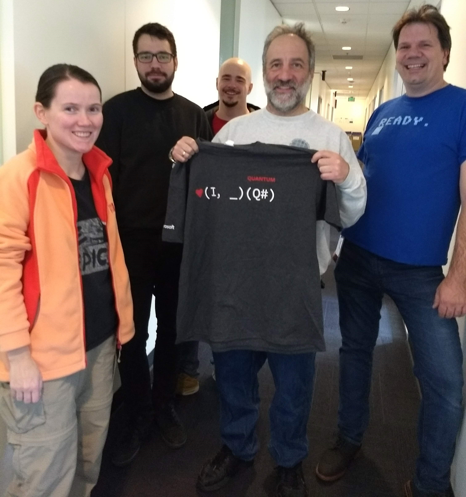

<b>TLDR:</b> This post is about Simon's quantum algorithm and shows how one can implement it in Q# (we'll, mostly the heavily lifting is the classical post-processing which is done in C#). Also, we managed to track down Dan Simon, who was successfully hiding for 24 years in a Microsoft building until we found him using the corporate directory. Finally, we share a detail about Dan's FOCS'94 paper that might be a historical footnote of independent interest. 

## Recap: 1994, the year in which it all began

1994 was an eventful year. Some held their breath watching a car chase involving a white Ford Bronco. Many enjoyed the new Euro tunnel that facilitated travel between France and England. A popular movie educated us about mouthwatering Big Kahuna burgers and the World-Famous Jack Rabbit Slims Twist Contest. The world of figure skating saw the national champion stripped of her title. And as far as animated sitcoms are concerned, MTV introduced us to two delightful teenagers who entertained us with their hilarious exploits. Moreover, 1994 is considered by many as the year when quantum computing began to be taken serious after being considered a mere curiosity in the years prior. 

While some encouraging results about this new model of computation were already known by then, such as the Bernstein--Vazirani algorithm for Fourier sampling which---upon applying a nifty recursive construction---can be shown to give an advantage over classical computing that is bigger than any polynomial, the opening bell for age of quantum computing was really rung at FOCS'94 which featured two seminal papers: Shor's quantum algorithms for solving discrete logarithms and for factoring of integers and Simon's quantum algorithm for figuring out bit-masks that describe the collisions of certain 2-to-1 functions. 

Due to its impacts on cryptography---after all, it shatters many of the primitives on which currently deployed public key cryptography relies---the former quantum algorithm is often mentioned as a poster child for quantum computing. Simon's algorithm has received quite a bit less attention. However, it is by no means less important nor less interesting, so we dedicated this post to Simon's algorithm and how one can implement it in a quantum programming language such as Q#. 

## Finding a bit-mask

Let's assume we have a Boolean function $f: \\{0,1\\}^n \rightarrow \\{0,1\\}$ which has the following properties: 
<li> we can evaluate $f$ on a quantum computer by applying a unitary $U_f: |x\rangle|y\rangle \mapsto |x\rangle |y\oplus f(x)\rangle$, and </li>
<li> $f$ is a 2-to-1 function where all collisions have an interesting additional structure: there exists a bit-vector $s\in \{0,1\}^n$ such that whenever $f(x)=f(x')$ 
then $x=x' \oplus s$. </li>

Our task is to find the bit-vector $s$, which we call the "period" of the function $f$.  

One might wonder how on earth one can find functions with this property. But after a little thought, such functions are actually not very difficult to manufacture. Indeed, just recall from linear algebra that if we are given an $(n-1) \times n$ matrix $M$ of rank $n-1$ (i.e., one less rows that we have columns), then there exists a non-zero vector $s$ that spans the <em>kernel</em> of that matrix, i.e., $M \cdot s={\mathbf 0}$ is equal to the zero vector. Now, if the matrix $M$ has Boolean entries, then moreover there is a unique vector $s$ that spans the kernel, i.e., we have that $M\cdot {\mathbf 0} = M \cdot s = {\mathbf 0}$.

Let's look at a simple example: The Boolean matrix $M$ defined as 
$$ M = \left[
    \begin{array}{ccccc}
    0& 1& 1& 0& 1 \\
    0& 0& 0& 1& 0 \\
    0& 1& 0& 0& 1 \\
    1& 1& 0& 1& 1
    \end{array}
    \right]
$$ 
has the kernel given by $[ (0, 0, 0, 0, 0), (0, 1, 0, 0, 1) ]$. In this case, the period is given by $s=(0,1,0,0,1)$.  

Functions of the form $f(x) = M \cdot x$, where $M$ is a fixed Boolean $(n-1)\times n$ matrix, are our prototypes of instances of Simon's problem. They satisfy the two conditions above as it is easy to find a quantum circuit which implements $U_f$ (indeed, this can be accomplished by a network of CNOT gates which can be read off directly from the matrix $M$) and the 2-to-1 property with respect to a period vector follows from linear algebra. 

In the following we show how these types of functions can be instantiated in Q#. It should be noted that to make the problem hard for classical computers, more work is needed: one should permute the output vectors using some scrambling permutation $\pi$ that maps all $2^{(n-1)}$ output vectors to itself, i.e., $f = \pi \circ M$ would be another instantiation of Simon's problem. Presumably, this would be harder to solve if we could only "obfuscate" the way in which $f$ was constructed. However, to the best of my knowledge, it is an open problem to make Simon's algorithm a "white box" problem (which is one of the main differences to Shor's algorithm for which the underlying function $f$ has a white-box implementation). A white-box problem is one where there are no components that cannot be inspected by the algorithm, i.e., you can think of a white-box problem as the input being given as a circuit for which a complete description is known.  

## Simon's algorithm in Q# and C#

The [Microsoft Quantum Development Kit](https://www.microsoft.com/en-us/quantum/development-kit) already comes with reference implementations ranging from simple quantum algorithms such as Bernstein--Vazirani or Deutsch--Jozsa over simulation algorithms for chemistry to complex quantum algorithms such as Shor's algorithm. We implemented Simon's algorithm as a [kata](https://en.wikipedia.org/wiki/Kata_(programming)), which is a self-paced tutorial in which a learner to explore basic principles of a new programming language and do so at his or her own pace. This kata can be found [here](https://github.com/Microsoft/QuantumKatas/tree/master/SimonsAlgorithm). 

The quantum part of Simon's algorithm is beautiful in its simplicity: all we have to do is create a uniform quantum distribution of all possible inputs to $f$ at the same time (a so-called superposition of all inputs), then evaluate the function $f$ via the quantum operation $U_f$, and finally measure the resulting quantum state in the so-called standard computational basis. All these operations can be performed very easily in Q#: 

```
operation SimonsAlgorithm (N : Int, Uf : ((Qubit[], Qubit[]) => Unit) : Int[]
{
    mutable resultBitmask = new Int[N];

    // allocate 2N qubits: N for the inputs, N for the outputs. 
    using (qs = Qubit[2*N])
    {
        // split allocated qubits into input and output register
        let xs = qs[0..N-1];
        let ys = qs[N..2*N-1];

        // prepare qubits in the right state
        ApplyToEachA(H, xs);

        // apply the oracle
        Uf(xs, ys);

        // apply Hadamard to each qubit of the input register
        ApplyToEach(H, xs);

        // measure all qubits of the input register;
        // the result of each measurement is converted to 0/1 
        for (indexBitmask in 0..N-1)
        {
            if (M(xs[indexBitmask]) == One)
            {
                set resultBitmask[indexBitmask] = 1;
            }
        }

        // before releasing the qubits make sure they are |0⟩ 
        ResetAll(qs);
    }

    return resultBitmask;
}
```

It turns out that running this quantum algorithm once will produce a bit-vector $r_0$ that is perpendicular to $s$. Running it again will produce another bit-vector $r_1$ that is again perpendicular to $s$, and so on. Running the procedure $n$ time will with high probability yield a system of linear equations from which $s$ can be reconstructed uniquely by performing a kernel computation. This has been described in the [FOCS'94 paper](https://ieeexplore.ieee.org/document/365701) by Dan. Really nice expositions of this algorithm are available. I personally learned it from a papers that [Peter Høyer and Gilles Brassard](https://ieeexplore.ieee.org/document/595153) and [Michele Mosca and Arthur Ekert](https://link.springer.com/chapter/10.1007%2F3-540-49208-9_15) wrote in the mid 90's and which paved the way to generalizations which are known as the so-called "hidden subgroup problem", a tantalizing problem which would in its full generality allow to solve such interesting problems as graph isomorphism. 

The classical part of the reference implementation of Simon's algorithm is really simple. We used JSON to store our test inputs, which consist of pairs of a matrix and a kernel vector. Here is one of the test inputs (again, you can convince yourself that the kernel is indeed spanned by the given vector):

```
{
  "instance": 13,
  "transformation": [
    [ 0, 1, 1, 0 ],
    [ 1, 0, 0, 0 ],
    [ 0, 1, 0, 1 ]
  ],
  "kernel": [ 0, 1, 1, 1 ]
},
```

The C# code then deserializes each JSON object, and turns it into an IEnumerable. From this then the instance $U_f$ is created (not shown here). 
Once the perpendicular vectors $r_0$, $r_1$, etc. have been measured, the final step is applying Gauss' algorithm for the computation of the kernel. This again is done in C#. 

```C#
public class GaussianElimination
{
    /// <summary>
    /// Finds all vectors v for which vM = 0, where M is a matrix.
    /// </summary>
    /// <param name="matrix">linear transformation</param>
    /// <param name="minimalRank">required minimal rank</param>
    /// <returns></returns>
    public static List<BooleanVector> GetKernel(BooleanMatrix matrix, int minimalRank)
    {
        matrix = new BooleanMatrix(matrix);

        var columnPivot = new List<int?>();
        var row = 0;

        for (var column = 0; column < matrix.Width; column++)
        {
            var foundPivot = FindPivotAndSwapRows(matrix, row, column);
            if (foundPivot)
            {
                ReduceRows(matrix, row, column);
                columnPivot.Add(row);
                row++;
            }
            else
            {
                columnPivot.Add(null);
            }
        }

        if (row < minimalRank)
            throw new InvalidOperationException(
                "Matrix rank insufficient");

        return FindSolution(matrix, columnPivot, 0).Select(list => 
            new BooleanVector(Enumerable.Reverse(list))).ToList();
    }
}
```

# The 2018 Microsoft Hackathon team and tracking down Dan Simon

The kata to explore Simon's algorithm was developed during the [2018 Microsoft Hackathon](https://news.microsoft.com/life/hackathon/) that saw several really cool Q# katas contributed by people who had previously little or no quantum computing knowledge. Within 3 days time, the entire sample was written and after a code review, the pull request to the kata repo was approved a few days later. The team that developed the entire sample included [Szymon Stankiewicz](https://github.com/SzymonStankiewicz), [Kasjan Siwek](https://github.com/kasjan-s), [Mikolaj Lisik](https://github.com/milisik), [Martin Roetteler](https://github.com/martinquantum), and [Mariia Mykhailova](https://github.com/tcNickolas). 


<p align="center">Dan Simon (center, with T-Shirt) and the brave Hackathon team that implemented the kata for Simon's algorithm</p>

After completing the code, we realized that Dan Simon is actually a Microsoft employee! He does not work in quantum computing anymore, but that didn't stop us from looking up his office and visiting him to tell him about the kata and to give him a Q# T-Shirt as a present. We didn't come a minute too early as we learned during our visit that Dan actually retired a few weeks later, after having spend over 24 years at Microsoft working on security and crypto applications: he told us that he joined Microsoft right after his PhD with Gilles Brassard which led to the FOCS'94 paper. 

Dan also shared an interesting anecdote, which complements an anecdote that Peter Shor shared at his [QIP'04 keynote](https://qipconference.org/2004/schedule.html) where he mentioned that he served on the FOCS Program Committee in 1993. Dan had submitted his paper to FOCS'93 which was rejected. Peter became aware of the paper, and it inspired him to come up with his famous quantum algorithms for discrete log and factoring which he then submitted to FOCS'94, where both Dan's and Peter's papers were accepted. 

The new wrinkle to this story is something we learned from Dan: he told us that he and Peter actually made a pact: in 1994 the market for quantum computing papers was super-thin and not many (if any!) papers were expected to be accepted to a high-profile conference such as FOCS. So the deal was that if one of the two papers gets in and the other one gets rejected, then they would have merged the papers anyways and published it as a two-author paper (!) Both papers got in and the rest is history. 
